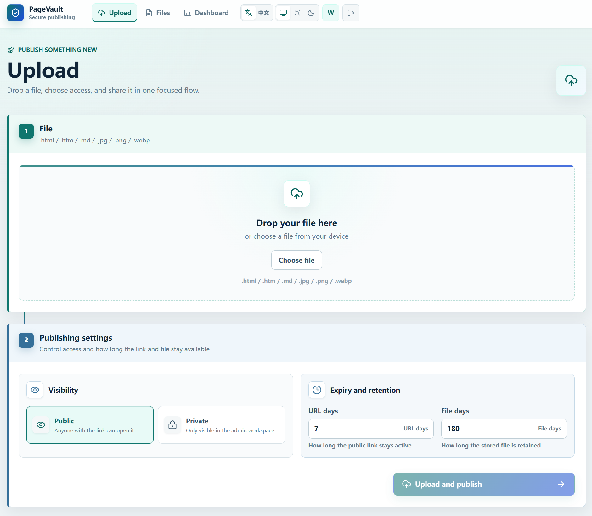

# PageVault

[](https://github.com/vdeng-ai/PageVault/actions/workflows/ci.yml)
[](https://github.com/vdeng-ai/PageVault/actions/workflows/docker.yml)
[](./LICENSE)

Language: English | [简体中文](./README.zh-CN.md)

PageVault is a lightweight, self-hosted publishing and lifecycle management system for HTML, Markdown, and image files. It keeps original uploads private, exposes only valid public URLs through an application gateway, and provides a focused web workspace for a single administrator.



## Highlights

- Publish `.html`, `.htm`, `.md`, `.markdown`, `.jpg`, `.jpeg`, `.png`, and `.webp` files.
- Control public URL expiry and stored-file retention independently.
- Switch content between public and private, disable access, restore records, or delete them.
- Track file status, access counts, expiry, and upcoming retention cleanup from the dashboard.
- Keep R2 buckets and local object storage private; public reads always pass through PageVault checks.
- Deploy to Cloudflare Workers or run the same service with Docker.
- Use the admin interface in English or Simplified Chinese, with light and dark themes.

## Architecture

PageVault keeps business logic in `packages/core` and uses runtime-specific adapters:

| Runtime    | Application                    | Metadata | Object storage    |
| ---------- | ------------------------------ | -------- | ----------------- |
| Cloudflare | Worker + Workers Static Assets | D1       | Private R2 bucket |
| Docker     | Node.js 22                     | SQLite   | Local files       |

Production uses separate admin and public hostnames. The incoming `Host` header selects the admin workspace or public publishing gateway, while the same service enforces visibility, status, and expiry rules.

## Getting Started

Install [Node.js 22](https://nodejs.org/), then enable the repository-pinned package manager and install dependencies:

```bash
corepack enable
pnpm install
```

Generate the password hash required by both deployment modes:

```bash
pnpm tsx scripts/hash-password.ts
```

Then choose a deployment target:

| Target     | Best for                                       | Guide                                                |
| ---------- | ---------------------------------------------- | ---------------------------------------------------- |
| Cloudflare | Managed serverless runtime with D1 and R2      | [Cloudflare deployment](./docs/cloudflare-deploy.md) |
| Docker     | Self-managed server with SQLite and local disk | [Docker deployment](./docs/docker-deploy.md)         |

For a contributor-oriented local setup, see [CONTRIBUTING.md](./CONTRIBUTING.md).

## Documentation

- [Configuration reference](./docs/configuration.md)
- [Cloudflare deployment](./docs/cloudflare-deploy.md)
- [Docker deployment](./docs/docker-deploy.md)
- [HTTP API](./docs/api.md)
- [Runtime security model](./docs/security.md)
- [Vulnerability reporting](./SECURITY.md)

## Development

The main repository checks are:

```bash
pnpm run typecheck
pnpm run lint
pnpm run test
pnpm run build
```

See [CONTRIBUTING.md](./CONTRIBUTING.md) for local services, environment setup, and pull request expectations.

## Contributing

Issues and pull requests are welcome. Please read [CONTRIBUTING.md](./CONTRIBUTING.md) before proposing a change. Report security vulnerabilities privately according to [SECURITY.md](./SECURITY.md), not through a public issue.

## License

PageVault is available under the [MIT License](./LICENSE).
