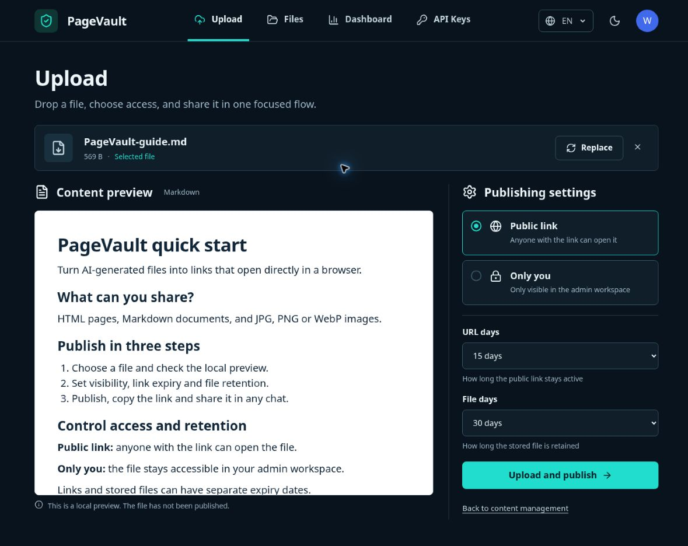

# PageVault

### 把 AI 作品变成一条在微信里也能直接打开的链接。

[](https://github.com/vdeng-ai/PageVault/actions/workflows/ci.yml)
[](https://github.com/vdeng-ai/PageVault/actions/workflows/docker.yml)
[](./docs/cloudflare-deploy.md)
[](./LICENSE)

[](https://deploy.workers.cloudflare.com/?url=https://github.com/vdeng-ai/PageVault)

语言：[English](./README.md) | 简体中文

PageVault 是一个为个人使用设计的自托管发布工具，用于在微信和其他聊天软件中分享 AI 生成的 HTML、Markdown、PDF、SVG 和图片信息图。它把不便在聊天窗口中直接预览的文件转换为可以在浏览器中一键打开的可控链接。

**上传内容 → 生成可控链接 → 粘贴到任意聊天窗口。**

**Cloudflare Free-first：** PageVault 明确面向个人使用，核心部署长期以 Workers、D1、R2、Workers Static Assets 和一个 Cron Trigger 的免费层为约束。项目主动避免重计算、Office 转换、复杂后台任务基础设施，以及会让核心部署变重的功能。

**v1.0 稳定基线：** A–L 路线图已经完成。此后 PageVault 按 SemVer 维护，默认优先正确性、安全、可靠性、性能和小型兼容改进，不再持续扩张产品边界。



英文界面 · 深色主题 · Markdown 发布前本地预览。

## 核心功能

- **Chat-ready sharing** — 把 IM 软件无法直接预览的 HTML、Markdown、PDF、SVG 和图片转换为浏览器链接。
- **Built for AI output** — 适合分享 AI 生成的交互页面、报告、说明文档和信息图。
- **One upload, one link** — 上传完成即可复制链接，无需建立完整网站。
- **Personal-first** — 单管理员设计，没有复杂的团队、租户和权限体系。
- **Controlled access** — 支持公开或私有、链接过期、文件保留期限、停用和删除。
- **Private storage** — 原始文件不直接公开，所有访问统一经过 PageVault 网关。
- **Deploy your way** — 可长期保持轻量运行在 Cloudflare 免费层，也支持 Docker。
- **Deliberately small scope** — 仅支持 HTML、Markdown、PDF、SVG、PNG、JPEG 和 WebP；不规划 DOCX/PPTX 转换、OCR、视频处理或服务端渲染流水线。

## 架构

PageVault 将业务逻辑集中在 `packages/core`，并为不同运行环境提供适配器：

| 运行环境   | 应用                           | 元数据 | 对象存储       |
| ---------- | ------------------------------ | ------ | -------------- |
| Cloudflare | Worker + Workers Static Assets | D1     | 私有 R2 bucket |
| Docker     | Node.js 22                     | SQLite | 本地文件       |

生产环境使用相互独立的管理端和公开访问主机名。服务根据请求的 `Host` header 选择管理界面或公开发布网关，并统一执行可见性、状态和过期时间检查。

## 开始使用

安装 [Node.js 22](https://nodejs.org/)，然后启用仓库固定版本的包管理器并安装依赖：

```bash
corepack enable
pnpm install
```

生成两种部署方式都需要的管理员密码哈希：

```bash
pnpm tsx scripts/hash-password.ts
```

然后选择部署方式：

| 目标       | 适用场景                             | 指南                                           |
| ---------- | ------------------------------------ | ---------------------------------------------- |
| Cloudflare | 可从免费层级起步的 D1 和 R2 托管环境 | [Cloudflare 部署](./docs/cloudflare-deploy.md) |
| Docker     | 使用 SQLite 和本地磁盘的自管理服务器 | [Docker 部署](./docs/docker-deploy.md)         |

面向贡献者的本地开发流程请参阅 [CONTRIBUTING.md](./CONTRIBUTING.md)。

## 文档

- [产品方向与路线图](./docs/roadmap.md)
- [v1 升级与回滚](./docs/upgrading.md)
- [发布流程](./docs/releasing.md)
- [支持边界](./docs/support.md)
- [更新日志](./CHANGELOG.md)
- [配置参考](./docs/configuration.md)
- [Cloudflare 部署](./docs/cloudflare-deploy.md)
- [Docker 部署](./docs/docker-deploy.md)
- [HTTP API](./docs/api.md)
- [运行时安全模型](./docs/security.md)
- [漏洞报告方式](./SECURITY.md)

详细技术与协作文档统一使用英文维护，以避免双份文档长期产生差异。

## 开发

仓库的主要检查命令如下：

```bash
pnpm run typecheck
pnpm run lint
pnpm run test
pnpm run build
```

本地服务、环境配置和 Pull Request 要求请参阅 [CONTRIBUTING.md](./CONTRIBUTING.md)。

## 参与贡献

欢迎提交 Issue 和 Pull Request。提出改动前，请先阅读 [CONTRIBUTING.md](./CONTRIBUTING.md)。安全漏洞必须按照 [SECURITY.md](./SECURITY.md) 私下报告，请勿创建公开 Issue。

## 许可证

PageVault 基于 [MIT License](./LICENSE) 开源。
