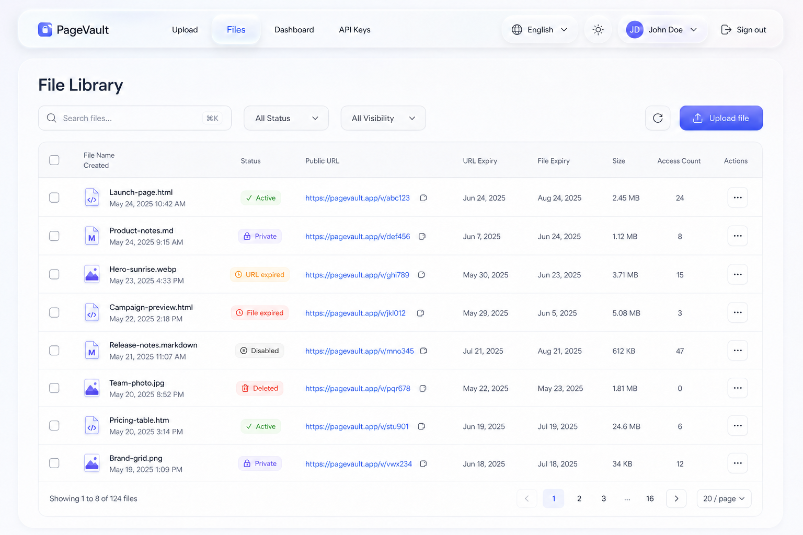
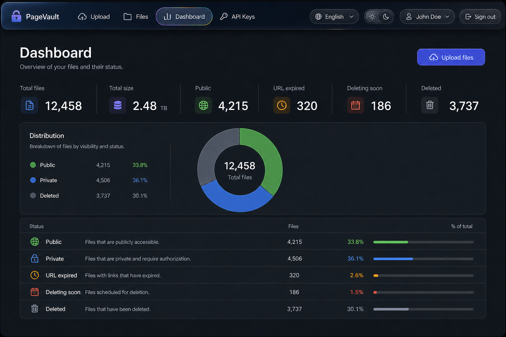
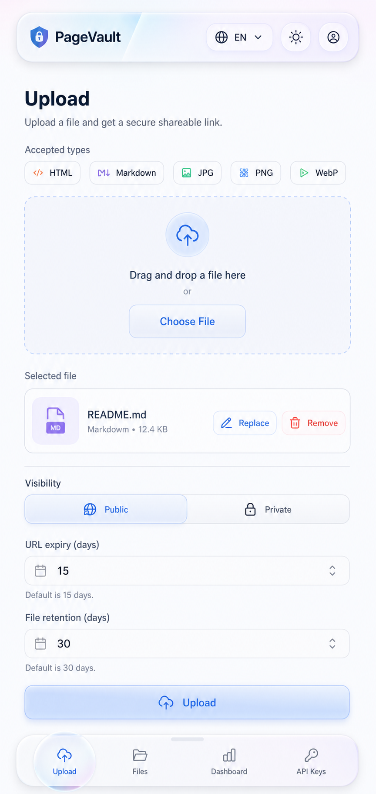
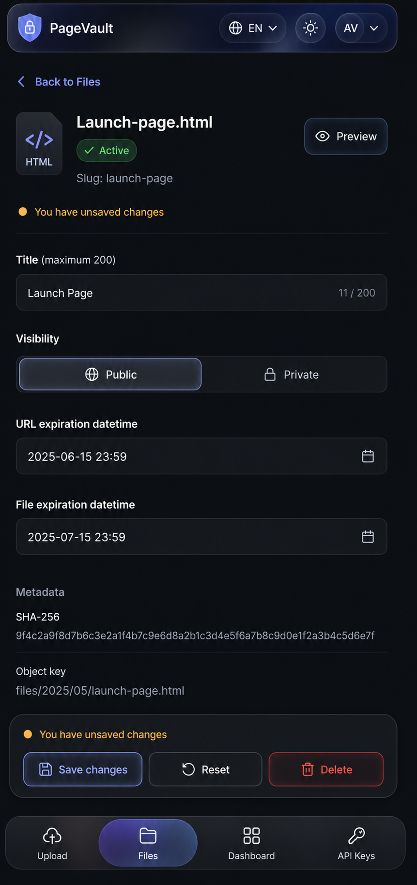
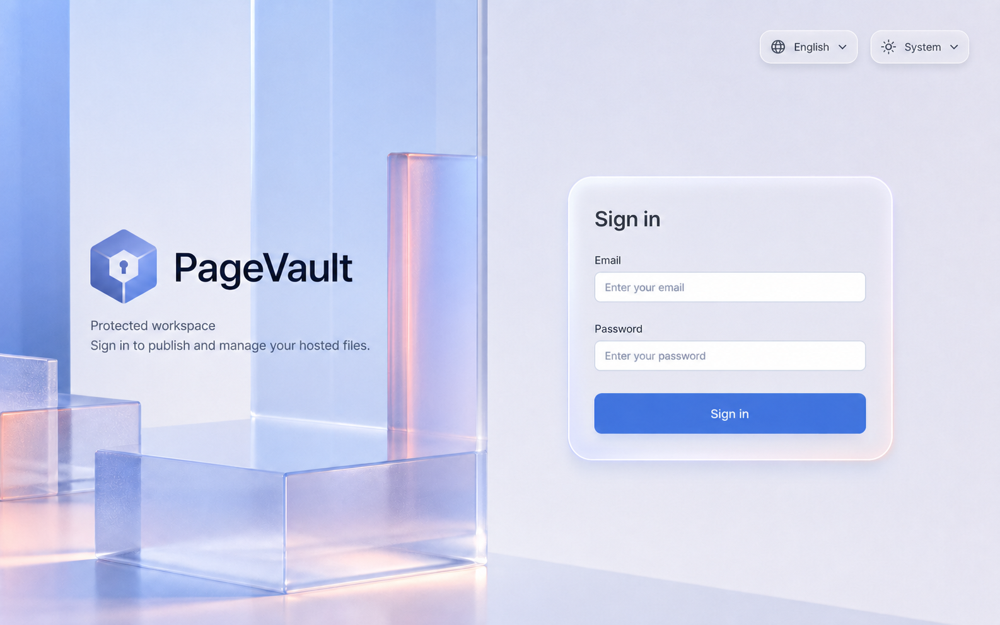
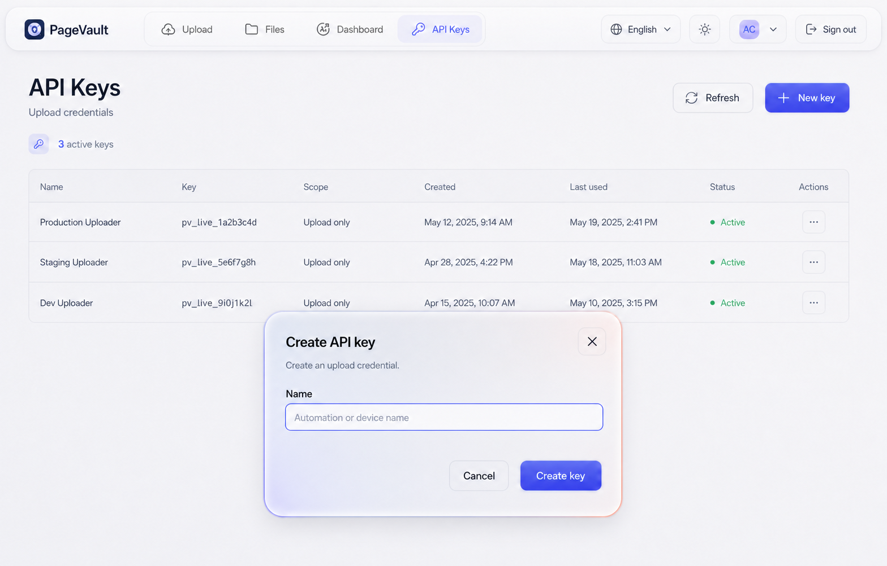

# PageVault Liquid Glass concept

Status: **Approved and implemented.**

This is the Phase 1 audit and Phase 2 visual baseline. Routes, information architecture, business logic, APIs, fields, content, and workflows remain unchanged.

## Audit

| Route | Preserved workflow |
| --- | --- |
| `#/`, `#/upload` | Pick/drop supported file, inspect, visibility, URL/file expiry, upload, result URL actions. |
| `#/items` | Search, status/visibility filters, pagination, selection, batch and row actions. |
| `#/items/:id` | Edit title/visibility/expiries, preview, save/reset/delete, SHA-256/object key, dirty navigation. |
| `#/dashboard` | Six metrics, distribution, runtime signals, loading/error/empty, upload CTA. |
| `#/api-keys` | List/refresh, create named upload key, one-time token, copy, revoke. |
| Auth | Email/password login, language and system/light/dark theme. |

The shell keeps the PageVault brand, four primary routes, English/Chinese, system/light/dark themes, account identity, sign out, desktop top navigation, and mobile bottom navigation.

Immutable contract:

- Files remain HTML/HTM, Markdown/MD, JPG/JPEG, PNG, and WebP only.
- Visibility/states, item fields, batch actions, validations, endpoints, CSRF, search cancellation/debounce, pagination, and confirmations remain.
- API key scope remains fixed and informational as Upload only.

Current findings:

- React 19 + Vite + Tailwind 4. Existing shared behavior is reusable.
- `styles.css` and `precision.css` both own tokens, glass, components, and breakpoints, causing override drift.
- Current refraction is blur, gradients, chromatic edges, and pointer highlights; there is no true Optical Glass primitive.
- Glass is selector-driven, not a reusable component system.
- Typography is Inter-first, not Apple-system-first, and lacks semantic type roles/optical sizing.
- Some targets are under 44px. WebKit backdrop, reduced-transparency, and increased-contrast fallbacks are missing.
- Responsive rules are duplicated. Mobile API Keys hides fields that need an equivalent responsive presentation.
- Preserve focus traps, Escape/focus return, busy/confirm states, cancellable search, i18n/theme, live feedback, and reduced motion.
- Improve the fixed 420ms navigation motion, toast keyframe, touch hover behavior, 44px targets, and row-menu arrow navigation.

## Visual direction

**Apple design language adapted for the web:** calm, content-first workspaces. Dense content stays opaque. Liquid Glass is reserved for navigation and transient/control chrome, never every section.

Palette: pearl/graphite environment, restrained cobalt-violet identity, cyan/coral only as transmitted spectral edge color.

Materials:

1. **G0 Content:** opaque forms, tables, metadata, metrics; grouped with type, space, and separators.
2. **G1 Standard Glass:** translucent, blurred/saturated, environmental transmission, hairline rim, top specular highlight, grounded layered shadow.
3. **G2 Optical Glass:** G1 plus restrained SVG displacement/refraction and optional sub-pixel chromatic edge. One or two focal surfaces per viewport; G1 is the fallback.
4. **G3 Elevated Glass:** dialogs, confirmations, token, toasts, dirty actions. Nested controls remain opaque or G1.

Use fluid squircle geometry, an Apple system-first semantic type ramp, tabular figures, immediate press feedback, 120-180ms high-frequency transitions, and interruptible transform/opacity motion. Do not invent draggable UI. Initial implementation needs no Motion/GSAP dependency.

## Concept boards

These are layout/material references. Implementation uses real data and existing translated copy.

### Desktop Light - Files

### Desktop Dark - Dashboard

### Mobile Light - Upload

### Mobile Dark - File detail

### Desktop Light - Login

### Desktop Light - API Keys

## Implementation record

The implementation uses one token source plus `GlassSurface`, `GlassButton`, `GlassNav`, `GlassToolbar`, `GlassSheet`, `GlassDialog`, `GlassPopover`, and `GlassSegmentedControl`, with solid accessibility/browser fallbacks.

Cloudflare remains client-side only: no new Worker calls, storage products, analytics writes, schedules, API routes, or network calls. CSS/SVG optical effects are limited to small focal surfaces and degrade for accessibility/low-capability contexts.

The approved implementation retains the palette, G0-G3 allocation, navigation, type density, limited Optical Glass use, and six concept boards.

Note: local `view_image` remained blocked by a host sandbox helper error. Generated previews and final browser screenshots were inspected through an image-data fallback, and the final Playwright/Chrome visual and interaction QA passed.
